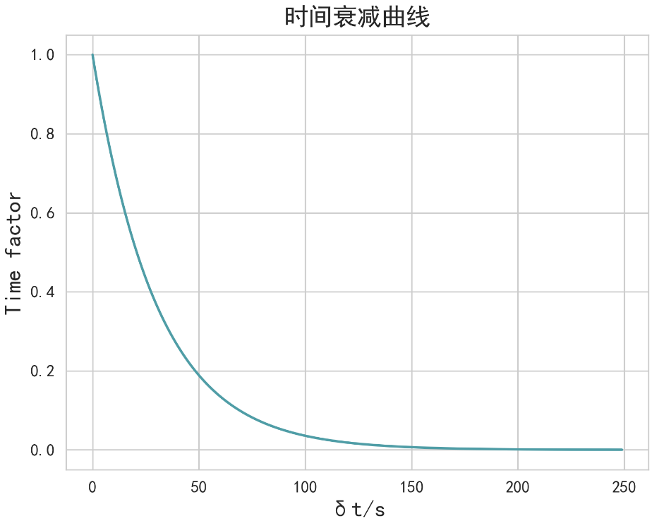

# 基于语义和时间感知的动态消息队列（TAMQueue）

核心思想为：通过结合消息的语义相似度和时间因素，动态调整消息的优先级，以确保重要消息能够及时处理。

处理思路为：考虑弹幕消息具有时效性。即“发送消息时间太远”的消息不具有时效性，我们应该降低这类消息的优先级。

为此，我们将一个消息的优先级公式定义为：

$$
score = -sim(message) *\frac{1}{1+e^{ \frac{t-t_0}{30} }}
$$

* 语义相似度：即sim(message)，使用Vector Similarity计算得到的语义相似度分数，值范围为0\~1，其中值越低表示与主题越相关
* 时间衰减因素：$\frac{1}{1+e^{ \frac{t-t_0}{30} }}$为其中$t_0$为进入的时间戳，$t$为排序时的时间戳，t越大，值范围为0~1，消息与进入的时间相隔越大，时间衰退因素越小。

  


`TAMQueue` 类中定义了两个队列：

* `queue1`：用于存储管理员消息，优先级最高。
* `queue2`：用于存储用户消息，根据优先级排序。

```python
class TAMQueue(DynamicMessageQueue):
    def __init__(self) -> None:
        self.queue1 = []
        self.queue2 = []
        // 记录上次重排序的时间
        self.last_time = datetime.now().timestamp()
        self.lock = threading.Lock()
```

通过两个队列管理消息，优先处理管理员消息，并根据消息的相似度和时间因素对用户消息进行动态优先级排序。实现了线程安全的消息插入、弹出和重排序，确保在多线程环境下的正确性。用于管理不同优先级的消息队列。

其中，我们仅在消息插入的时候进行语义排序：

1. 每隔 `60 秒`对次优先级队列（`queue2`）进行一次重排序，以确保新的重要消息能迅速提升优先级。
2. 使用线程锁（`lock`）来确保多线程环境下的操作安全，避免数据竞争和不一致性

```python
def push(self, message: Message):
    with self.lock:
        # 介绍到管理员消息时，将其放在第一队的队首
        if message.kind == MessageKind.Admin:
            self.queue1.insert(0, message)
        else:
            message.timestamp = datetime.now().timestamp()
            message.sim = self._searcher.similarity(message.content)
            self.queue2.append(message)
            # 60s重排序一次
            current_time = datetime.now().timestamp()
            if (current_time - self.last_time > 60):
                self.queue2.sort(key=lambda x: self.calculate_total_priority(x.timestamp, current_time, x.sim))
                self.last_time = current_time
```
