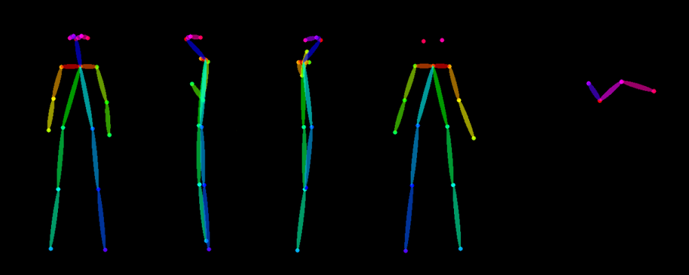
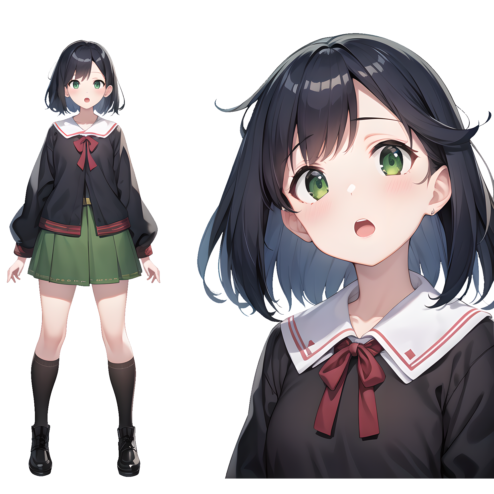

# 视图层

视图层模块是数字人系统的“门面”，是数字人与观众交互的主要形式之一。
考虑到视图层的实现方式有很多，比如
 [Live2D](www.live2d.com)、
 [Vtube Studio](https://denchisoft.com/)、
 [UE5](https://www.unrealengine.com/en-US/unreal-engine-5)、
 [EasyAIVtuber](https://github.com/Ksuriuri/EasyAIVtuber)，
我们为视图层定义了几个常用的接口，方便后续使用不同的实现方法，并仅仅通过实现接口就可以运行。

## 接口

在本模块中，主要通过 `Renderer` 对象来提供视图层的功能。
其中，它具有的接口如下：

- `speak(self, path: str)` : 
视图层做出说话动作，并且播放 `path` 路径下的音频文件。
- `background_music(self, path: str)` : 
视图层跟随 `path` 路径下的背景音乐做出动作，可以是摇摆等。
- `stop_move(self)` : 
视图层停止一切动作。

这些接口的功能已近基本上覆盖了数字人直播所需要的功能。
若希望额外实现功能，也可以通过在子类添加参数来实现重写，并在调用时加以区分。

## 形象设计

### 人设

本次数字人是一名中大校史介绍官，主要的场景是直播。
一方面为了符合中山大学校史介绍官的角色，另一方面考虑到直播受众大多为对中山大学校友同学或者是希望报考中山大学的广大学子，我们决定数字人风格采用 2D 卡通风格。

综合多方面考虑，我们的中大校史介绍官人设如下：

```
姓名：中小大
性别：女性
年龄：20岁
身份：中山大学大三学生，中山大学校史介绍官
专业：软件工程
性格特点：活泼开朗，热情友善，善于交流，喜欢探索和分享学校的历史和文化
爱好：写代码、阅读历史书籍、参加社团活动、参观校园景点、与新生交流
```

### 设计

考虑到本开发组成员建模经历较少，所以我们决定采用 `EasyAIVtuber` 来实现视图层。
其只需要一张正面的人物图片就能够生成特定的动作，从而无需对人物进行建模。

同样的，我们采用生成式模型 `Stable Diffusion` 来生成这张照片。
生成工具使用
 [Stable Diffusion web UI](https://github.com/AUTOMATIC1111/stable-diffusion-webui.git)，
模型列表如下：

- `Stable Diffusion` (扩散模型，用于 Text-to-Image) : 
[stablediffusionapi/anything-v5](https://huggingface.co/stablediffusionapi/anything-v5)
- `Lora` (使用三视图数据 Lora 微调的权重) : 
[ducnapa/charturnerbetalora](https://huggingface.co/ducnapa/charturnerbetalora)
- `Controlnet` (通过关键点控制图像生成) : 
[lllyasviel/control_v11p_sd15_openpose](https://huggingface.co/lllyasviel/control_v11p_sd15_openpose)

文生图任务中，模型的选择会对生成效果产生很大影响，但是 `Prompt` 的影响同样不容忽视。
为了生成符合需求的图像，我们编写了如下的 `Prompt`：

```bash
## 正面提示词
# 画质词+画风词
(masterpiece:1.2), best quality, highres, extremely detailed CG, 8k wallpaper, studio ghibli,
# 画面主体描述
1girl, simple background, (white background:1.5), multiple views, 
# 画面人物细节
high ponytail, black hair, open mouth, green skirt, slim, 
# 使用三视图数据微调的 Lora 权重
<lora:charturnbetalora:0.2>, 
## 负面提示词 (一系列低画质的描述)
(worst quality:2), (low quality:2), (normal quality:2), ... ,lowres, normal quality, ... 
```

并且为了让生成的图像符合三视图的人设图要求，我们添加了使用三视图数据 Lora 微调权重，以及通过关键点控制图像生成的 Controlnet 模型，生成了初始的人设图。

<p style="text-align:center">
  
   
  <br>Controlnet 骨架图 与 生成的三视图
</p>

然后通过人工 PS 微调图像（比如手型、眼睛颜色等），得到最终的人设图。

<div style="text-align:center">
  
</div>

## EasyAIVtuber

[EasyAIVtuber](https://github.com/sse-digital-man/EasyAIVtuber) 基于 Khungurn 等人的<sup><a href="https://arxiv.org/abs/2311.17409">1</a></sup> 带有注意力层的 U-Net 结构的模型，能够从单张动漫角色图片生成可控动画。模型权重使用 [talking-head-anime-3-models-standard_half](https://huggingface.co/ksuriuri/talking-head-anime-3-models)。

我们使用原始仓库的代码，实现了上述的三个接口。
同时通过进程池管理，完善了原始仓库的关闭机制，使得其生命周期可控。

其中有部分参数可供配置：

- `beat` : 说话节拍。
- `mouth_offset` : 嘴型大小。
- `sleep` : 入睡间隔。

启动项目后，`EasyAIVtuber` 会启动一个虚拟摄像头。
虚拟摄像头可以使用 OBS 的虚拟摄像头，也可以安装 [UnityCapture](https://github.com/schellingb/UnityCapture) 的虚拟摄像头，可以直接选择透明通道，从而获得透明背景。
最后，可以通过安装 [OBS](https://obsproject.com/) 捕获摄像头输出用于直播。

## 直播间

> TODO: 直播间场景布置...