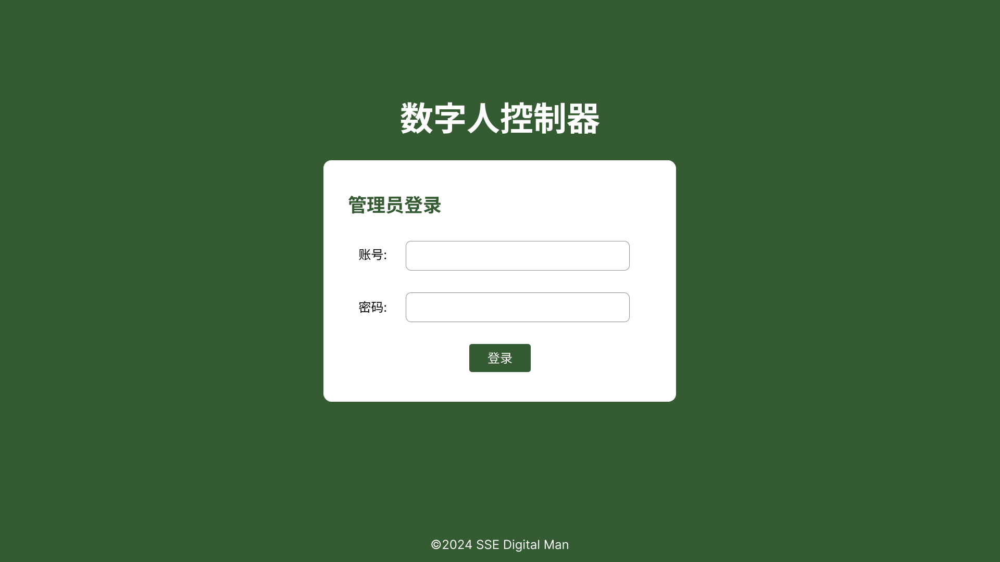
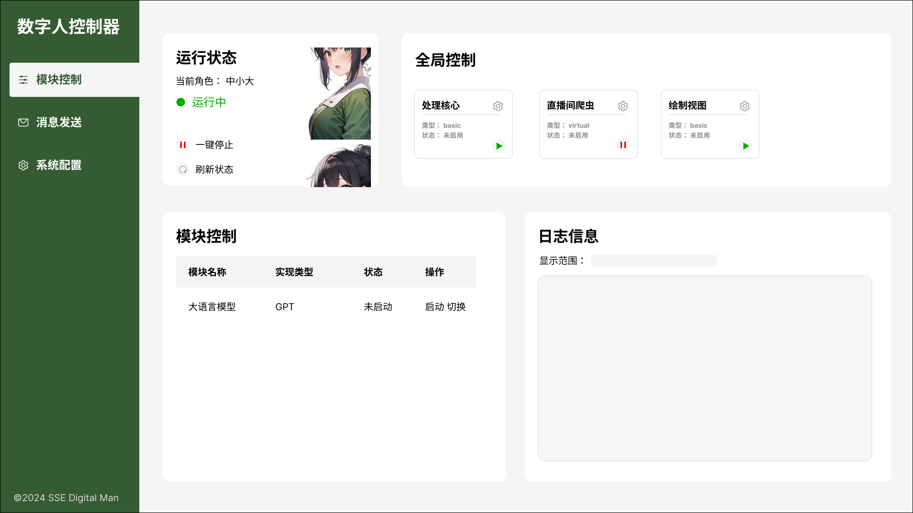
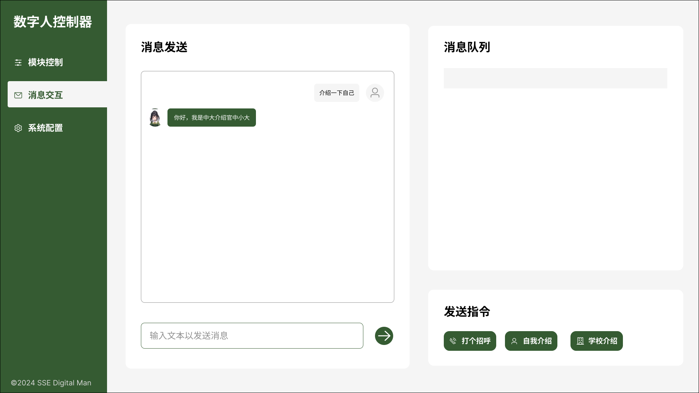
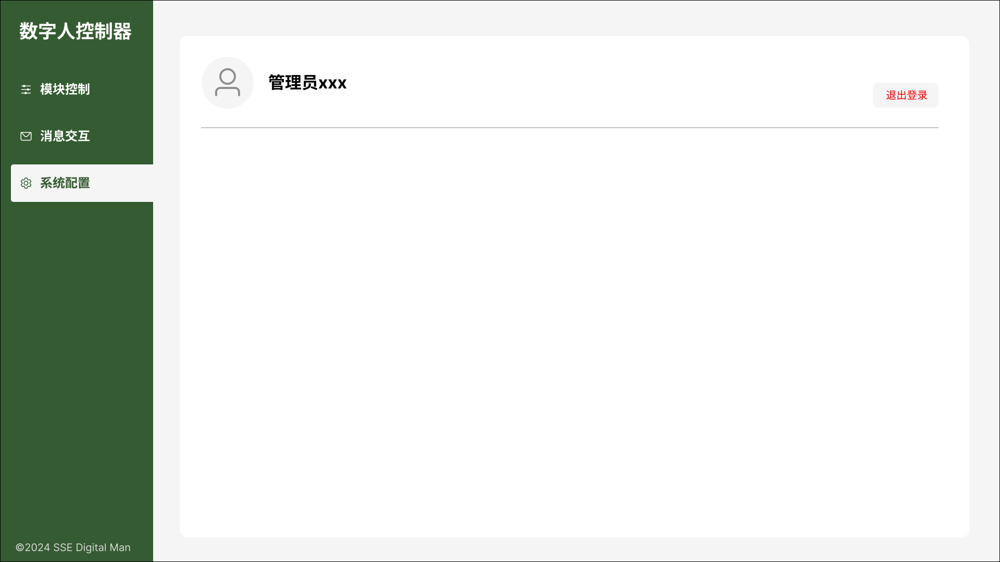
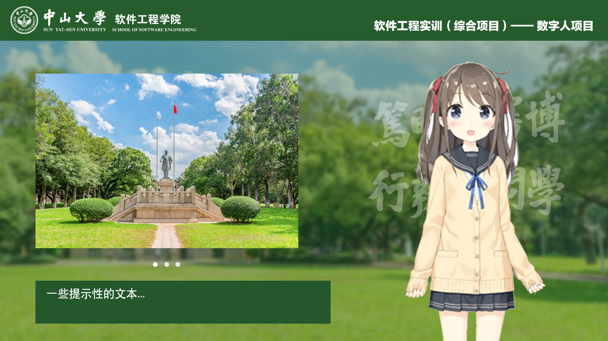

# 原型设计

本项目中与用户进行交互的主要是**控制器**和**直播间互动**。管理员可以通过控制器对数字人的模块进行管理和配置，并且可以再后台与数字人进行交互。而最终数字人会通过直播间进行呈现，观众可以通过进入直播间与用户进行交互。

本项目使用 Figma 进行原型设计。

> 源项目文件: [Figma](https://www.figma.com/file/QiaItyolW904fLVQYW3TyJ/%E8%BD%AF%E4%BB%B6%E5%B7%A5%E7%A8%8B%E6%80%BB%E7%BB%BC%E5%90%88%E5%AE%9E%E8%AE%AD?type=design&node-id=0-1&mode=design&t=RNBw7TQ1UZJBky6y-0)

## 控制器

本项目的控制器提供 Web-ui 形式的图形化界面供管理员使用，此外，在实际开发场景中，我们也提供了简单的 CLI 控制器，其主要用于开发场景，而非使用场景，因此在此不做过多介绍。

本项目的控制器根据功能划分成一下几个界面。

### 登录页面

本项目通过 Web-ui 的方式进行交互，因此在局域网内的所有用户都可以访问 IP 进行控制器后台页面。为了保证数字人在运行时不会受到其他人的恶意干扰，控制器需要通过账号密码进行登录才能使用。

目前的登录页面没有输入验证码验证、多次输入错误拒绝等方式进行安全校验，当输入正确的额账号和密码之后，
即可进入控制器内部。

> 值得注意的是，由于本系统能够使用的管理员较少，因此目前不提供前端管理管理员账号的情况，需要使用后台脚本直接对数据库进行写入。

### 控制器页面

在控制器页面，主要提供 3 个功能。

1. **模块控制**: 对数字人内部的模块进行控制、管理和配置
2. **消息发送**: 与数字人本体进行交互
3. **系统配置**: 配置包括管理员在内的系统信息

#### 1. 模块控制

模块控制页面是对数字人系统中各个子模块统一控制，具体包括以下 4 个子功能。

##### a. 运行状态

在该子功能中，
页面会显示当前数字人的**运行状态**和**运行人设**（人设相关内容会在渲染器部分详细介绍），
并且显示当前数字人人设的立绘。
此外，管理员可以通过一键的方式，全盘启动数字人和停止数字人，
也可以刷新当前数字人的状态，以保证当前页面显示的状态信息都是最新的。

##### b. 全局控制

全局控制部分控制的内容主要是本系统被划分为的最重要的 3 个部分，
处理核心、直播爬虫和人物渲染器。
这几个模块之间可以相对隔离的运行，也是管理员能够控制运行的最小单位。

##### c. 模块配置

模块配置是对系统内存在的模块进行更细粒度地配置，
主要是对模块的相关配置信息，和实现类型进行配置。
不过值得注意的，只有当对应的模块停止后，才能够正常修改。

##### d. 日志信息

该部分主要是实时地返回系统产生的日志信息，
管理员也可以设置显示范围来查看对应时间段内产生的日志信息。

#### 2. 消息交互

消息交互主要是用于管理员与数字人进行交互，主要分为 3 个功能子模块，
分别对应数字人与外部进行交互的 3 种方式。

##### a. 消息发送

管理员可以通过类似微信聊天的逻辑，与数字人进行沟通的聊天，
其上方将会显示当天聊天的历史记录信息。
如果数字人正在监听直播间的弹幕信息，
该聊天功能也不会受到影响，
显示的聊天记录只会与管理员之间的对话记录。

##### b. 消息队列

消息队列用于记录目前数字人接收到的消息弹幕信息内容。

> 此功能不是河西功能，因此暂时不会有很具体的内容。

##### c. 指令发送

管理员除了可以通过聊天功能与数字人进行交互，
还能通过发送指令命令数字人做一些之前预设好的行为，
目前仅支持**打个招呼**，**自我介绍**，**学校介绍**。

##### 3. 系统配置

系统配置则是用于配置一些系统的全局信息（而非具体模块的信息），
以及一些与用户相关的配置内容。

目前仅实现提供用户的退出功能。

## 直播间互动

直播间互动部分分为两个部分，数字人的人设和直播间布局。

### 数字人人设

> TODO: ...

### 直播间布局

直播间布局以中山大学的特色绿作为整体基调，
屏幕顶部用于标识该直播间是软件工程学院的综合实训项目。
而对于画面主体，
左边暂时放置的是一些轮播的宣传图片，
下面则是书写关于直播间相关的提示性文本。
右边则是数字人整体的显示区域。

